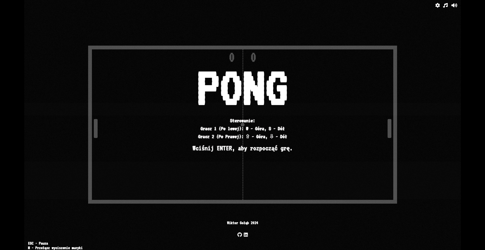
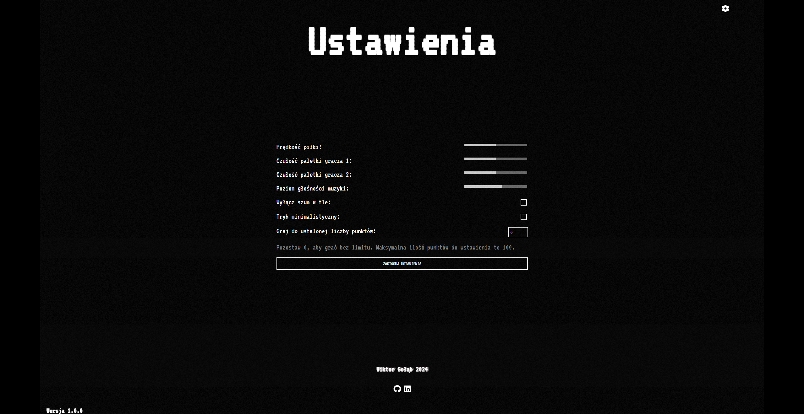
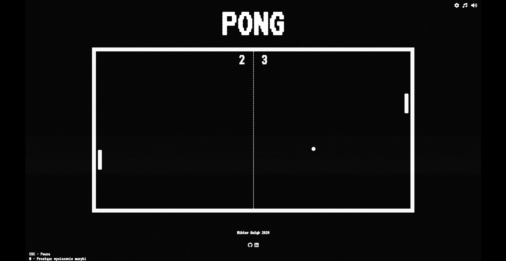

# PONG

**Pong** – klasyczna już gra komputerowa będąca symulacją tenisa stołowego przy użyciu grafiki dwuwymiarowej. Celem rozgrywki jest pokonanie przeciwnika poprzez uzyskanie wyższego wyniku punktowego. Gra wydana została w 1972 roku przez Atari i jest jedną z najstarszych przeznaczonych na automaty.  
`Źródło: Wikipedia.org`

W repozytorium znajduje się moja interpretacja tej gry, napisana przy użyciu `HTML`, `CSS`, `JavaScript` i `Node.js`.


###### Menu główne. Rozdzielczość ekranu: 2560x1440

### Wymagania
Do uruchomienia wymagany jest zainstalowany ***Node.js***. Aby sprawdzić, czy Node.js jest zainstalowany na Twoim komputerze, w CMD lub PowerShell wpisz komendę:
```bash
node -v
```
bądź alternatywnie:
```bash
node --version
```
W przypadku braku Node.js, zalecam zainstalowanie go z oficjalnej strony:
https://nodejs.org/en

## Instalacja
1. Pobierz repozytorium,
2. Rozpakuj folder,
3. Otwórz w folderze CMD i wprowadź komendę:
```bash
npm install express
```  
4. Uruchom plik `start.cmd`.

Alternatywne uruchomienie serwera z grą jest również możliwe, uruchamiając CMD w folderze z plikiem `server.js` oraz poprzez wpisanie następującej komendy:
```bash
node server.js
```

## Funkcje i cechy projektu


###### Ustawienia w grze. Rozdzielczość ekranu: 2560x1440

- Gra Pong w nowym wydaniu,
- Nowe elementy wizualne w tym szum VHS,
- Efekty dźwiękowe,
- Autorska muzyka stworzona przeze mnie,
- Opcja wyłączenia muzyki oraz dźwięków specjalnych,
- Możliwość pauzy gry (Klawisz ESC),
- Szereg różnych ustawień dostosowujących rozgrywkę:
  - Zmień prędkość piłki,
  - Zmień czułość obu paletek,
  - Wyłącz efekt szumu VHS,
  - Włącz tryb minimalistyczny (wyłączający rozpraszające napisy podczas gry),
  - Dostosuj poziom głośności muzyki,
  - Graj bez limitu na punkty oraz ustaw swój własny próg na zwycięstwo.

## Sterowanie


###### Rozgrywka. Rozdzielczość ekranu: 2560x1440

**Gracz 1 przyjmuje lewą część klawiatury:**
- W - Przemieszczenie się w górę,
- S - Przemieszczenie się w dół.

**Gracz 2 przyjmuje prawą część klawiatury:**
- Arrow Up - Przemieszczenie się w górę,
- Arrow Down - Przemieszczenie się w dół.
